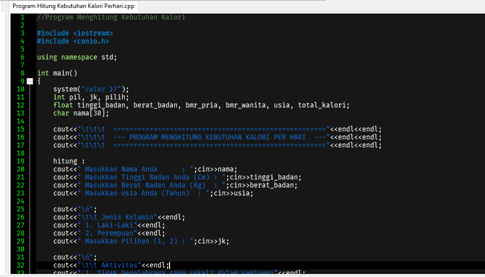
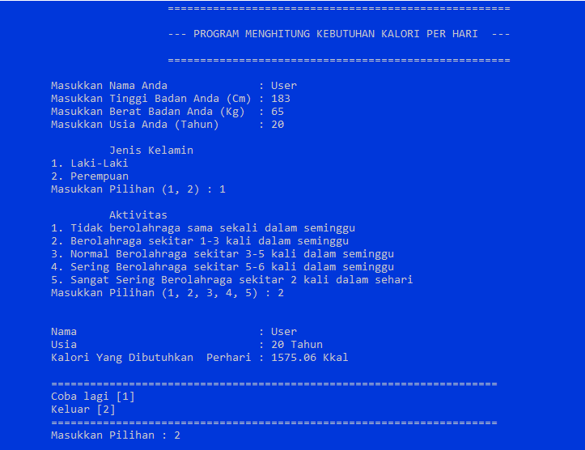

# HitungKebutuhanKaloriC++

## Tentang
Program untuk menghitung kebutuhan kalori sederhana dibuat dengan **C++**. Software yang harus dibutuhkan dan sudah terinstall yaitu: `Dev-C++`.

## Screenshoot

Hasil compile & running program:

## License
MIT &copy; 2021 reptr