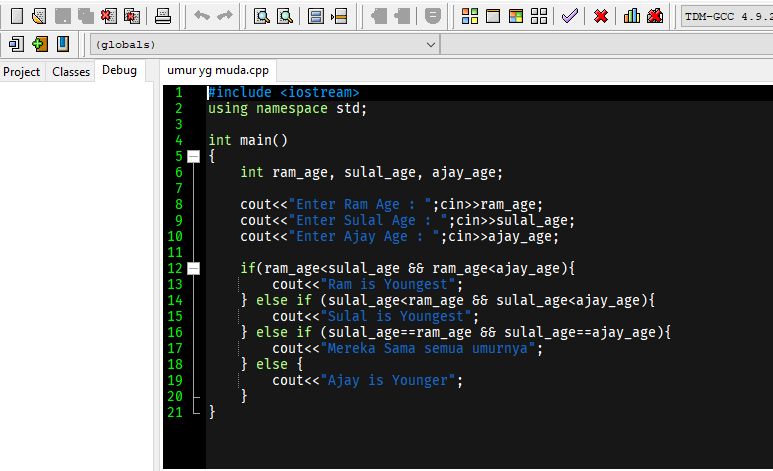
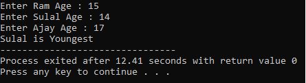

# programC++

## Daftar Isi

- [programC++](#programC++)
  - [Daftar Isi](#daftar-isi)
  - [About](#about)
  - [Getting Started](#getting-started)
    - [Prerequisites](#prerequisites)
    - [Installing](#installing)
  - [Screeenshoot](#screenshoot)

## About
Kumpulan **program C++** yang saya buat `semasa kuliah`. Semoga bisa menjadi contoh, referensi, atau dikembangkan bagi yang ingin belajar C++.

## Getting Started
Sebelum memulai, Instruksi dibawah ini akan memberikan and cara me-*copy* *program C++* dan me-*running* pada *local machine* anda baik di laptop atau PC.

### Prerequisites
Software yang harus dibutuhkan dan sudah terinstall yaitu:

```
Dev-C++
```

### Installing
Langkah demi langkah cara untuk menginstall project ini.

1. Pastikan **Software yang dibutuhkan** sudah **terinstall**
2. Download atau clone project ini
Copy pada terminal misal dengan  Command Prompt
```
git clone https://github.com/reptr/programC++.git  /direktori project
```

## Screenshoot
Contoh program C++



Hasil compile & running program:



## License
MIT &copy; 2021
